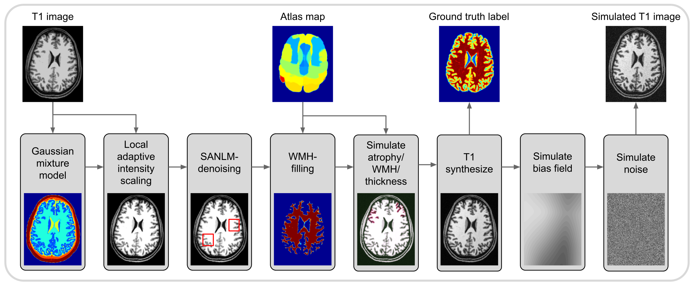
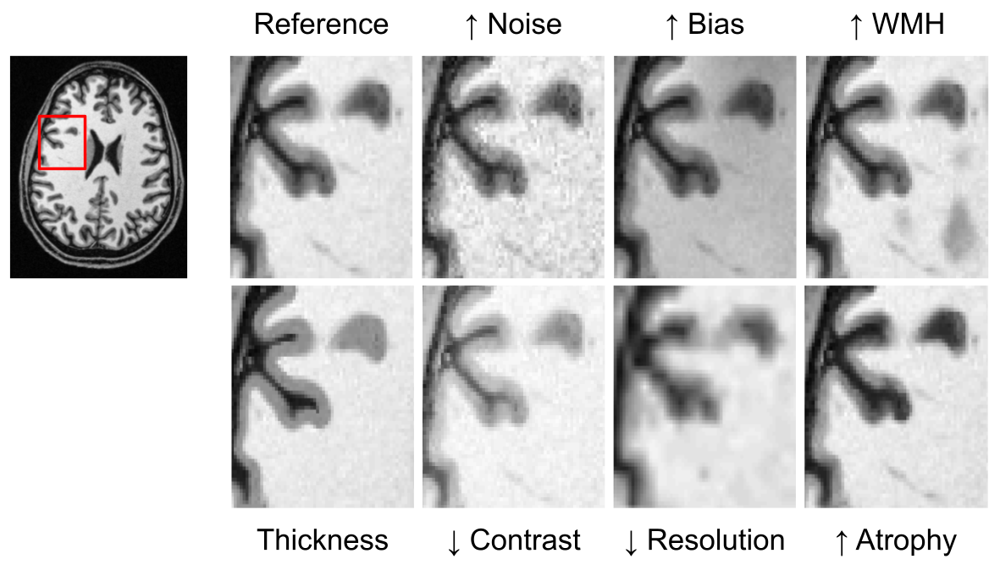

# mri_simulate
Simulates T1-weighted MR images with optional atrophy, cortical thickness control, WMHs, RF B1 inhomogeneities, and noise (Gaussian or Rician at a target WM SNR). Writes JSON sidecars with simulation metadata.



## Overview
`mri_simulate` generates a realistic T1-weighted (T1w) image and its explicit ground truth from a high-quality input (e.g., 0.5 mm Colin27 or a custom T1w). Key steps:

- Start from a segmented T1w volume (GM, WM, CSF, and background) using SPM unified segmentation; this is only an initialization.
- Locally normalize tissue intensities with CAT12 Local Adaptive Segmentation (LAS), scaling CSF/GM/WM to canonical values (1/2/3) to obtain a PVE-like label image.
- Denoise the scaled labels with SANLM; optionally close WM holes to remove native WMHs before adding synthetic lesions.
- Insert user-defined anatomical changes: atlas-based atrophy (e.g., Hammers) and probabilistic WMHs.
- Synthesize a new T1w by reusing the SPM forward model (Gaussian mixture params) but replacing the tissue posteriors with the modified PVE labels (and optional WMH class); optionally modulate with RF bias fields and add Rician or Gaussian noise.
- Outputs follow BIDS-like naming with JSON sidecars capturing all simulation parameters.

This label-driven synthesis minimizes dependence on the initial segmentation while preserving realistic tissue topology. RF fields can be predefined (MNI A/B/C) or simulated, and contrast-to-noise ratio plus voxel size are user-controlled.



## Cortical thickness and PVE simulation
To validate cortical thickness pipelines, the label image can be edited directly:

- Cortical thickness is defined geometrically: WM is morphologically closed, then GM is grown via Euclidean distance maps to reach target thickness (global or 3-region using the Hammers atlas).
- Thickness values can vary across regions (e.g., frontal, occipital, remaining cortex) to produce known ground truth.
- Partial volume is approximated by jittering tissue boundaries across multiple subvoxel offsets and averaging hard labels (CSF=1, GM=2, WM=3), replacing the original SPM labels in synthesis.


## Requirements
- MATLAB with SPM12 and CAT12 toolboxes in the path
- A T1-weighted NIfTI image (default examples use `colin27_t1_tal_hires.nii`)

## Inputs
### simu: Simulation parameters (struct)

Parameter | Description (Default)
----------|------------------------
name | Input image(s). A single T1w filename. (Default: `''`)
snrWM | add Rician magnitude noise with target SNR for white matter. Uses WM mean to derive complex noise sigma; when set, `pn` is ignored. (Default: `30`)
pn | If `>0`,add Gaussian noise as percent of the WM peak. (Default: `0`)
rng | RNG seed for reproducible noise; set `[]` for MATLAB default behavior. (Default: `0`)
contrast | Power-law exponent for contrast change. Image is normalized to [0,1], transformed as Y.^contrast, then rescaled to original min/max. Meaningful values to simulate contrast are 0.5 (low contrast) and 1.5 (high contrast). (Default: `1`)
derivative | If `1`, save outputs into BIDS derivatives at the dataset root: `derivatives/mri_simulate-1.0/sub-*/ses-*/...`, mirroring the subject/session path. (Default: `0`)
resolution | Output voxel size: scalar (applied to x,y,z) or `[x y z]`. `NaN` keeps the original resolution. (Default: `NaN`)
WMH | Strength of white matter hyperintensities. `0`=off; `1`=mild; `2`=medium; `3`=strong; values `>=1` allowed. Larger values broaden the WMH prior via exponent `1/(WMH-0.8)` and scale the label contribution by `~1/WMH^0.75`. Constrained to (eroded) WM and modulated by a random field. (Default: `0`)
atrophy | Atrophy specification: `{atlasName, roiIds[], factors[]}`; factors >1 increase CSF (reduce GM) within ROIs. Either thickness or atrophy can be simulated. (Default: `[]`)
thickness | Cortical thickness in mm. Scalar = global; 3-vector = `[occipital rest frontal]` using Hammer atlas masks. Subcortical/cerebellar regions are excluded from thickness simulation and the original thickness values are kept. Either thickness or atrophy can be simulated. (Default: `0`)

### rf: RF bias field parameters (struct)

Parameter | Description (Default)
----------|------------------------
percent | Amplitude in percent; negative values invert the field. (Default: `20`)
type | `'A'|'B'|'C'` (predefined MNI fields) or numeric `[strength rngSeed]` for a simulated field. Strength in `1..4` (3–4 ~ stronger 7T-like). (Default: `[2 0]`)
save | Save the simulated bias field only when `type` is numeric; ignored for `'A'|'B'|'C'`. (Default: `0`)

## Defaults
If `simu` and/or `rf` are omitted or partially specified, missing fields are filled with defaults. If `simu.name` is empty, a file selection dialog opens.

```matlab
simu = struct('name', '', 'snrWM', 10, 'snrWM', 0, 'contrast', 1, ...
              'resolution', NaN, 'WMH', 0, 'atrophy', [], 'thickness', 0, 'rng', 0);
rf   = struct('percent', 20, 'type', [2 0], 'save', 0);
```

## Outputs
The function saves:
- Simulated image: `snr{snrWM}_{meanRes}mm_{name}{opts}.nii`
- Simulated masked image: `snr{snrWM}_{meanRes}mm_m{name}{opts}.nii`
- Ground-truth PVE label: `label_pve_{meanRes}mm_{name}{opts}.nii`
- If requested, RF field (simulated only): `{opts}_{meanRes}mm_{name}.nii`
- JSON sidecars (main and masked images): `{simuFile}.json` including tool metadata and SimulationParameters (voxel size, pn or snrWM, RF settings, thickness tag)

Notes:
- When `pn>0`, filenames use `pn{pn}` instead of `snr{snrWM}`.
- `{opts}` aggregates options, e.g., `_rf20_A`, `_WMH2`, `_hammers_28_2`, `_thickness1.5mm-2.5mm`.
- When thickness is used, the label is PVE-like from the boundary jittering averaging.
- When WMH is used, a 4th label contribution is added (WMH).

## Usage
```matlab
mri_simulate(simu, rf);
```

### 1b) Rician noise at target WM SNR
```matlab
simu = struct('name', 'colin27_t1_tal_hires.nii', 'snrWM', 30, ...
              'resolution', NaN, 'rng', 0);
rf = struct('percent', 20, 'type', 'A', 'save', 0);
mri_simulate(simu, rf);
```

## Examples

### 1) Basic simulation with specific noise and 0.5 mm voxels
```matlab
simu = struct('name', 'colin27_t1_tal_hires.nii', 'snrWM', 10, ...
              'resolution', 0.5, 'atrophy', [], 'rng', 42);
rf = struct('percent', 20, 'type', 'A', 'save', 0);
mri_simulate(simu, rf);
```

### 2) Advanced simulation with atrophy (2% in left middle frontal gyrus and 3% in right middle frontal gyrus based on Hammers atlas), custom RF field and thicker slices
```matlab
simu = struct('name', 'custom_t1.nii', 'snrWM', 30, ...
              'resolution', [0.5, 0.5, 1.5], 'rng', []);
simu.atrophy = {'hammers', [28, 29], [2, 3]};
rf = struct('percent', 15, 'type', [3, 42], 'save', 0);
mri_simulate(simu, rf);
```

### 3) Thickness simulation (region-wise values, original resolution)
```matlab
simu = struct('name', 'colin27_t1_tal_hires.nii', 'snrWM', 10, ...
              'resolution', NaN, 'atrophy', [], 'rng', [], ...
              'thickness', [1.5 2.0 2.5]);
rf = struct('percent', 20, 'type', 'A', 'save', 0);
mri_simulate(simu, rf);
```

### 4) WMH simulation (medium strength) with simulated RF field
```matlab
simu = struct('name', 'custom_t1.nii', 'snrWM', 30, 'resolution', NaN, ...
              'WMH', 2, 'rng', []);
rf = struct('percent', 15, 'type', [3, 42], 'save', 0);
mri_simulate(simu, rf);
```

### 5) Interactive mode for example 4:
```matlab
simu = struct('snrWM', 30, 'resolution', NaN, ...
              'WMH', 2, 'rng', []);
rf = struct('percent', 15, 'type', [3, 42], 'save', 0);
mri_simulate(simu, rf);
```

### 6) Apply contrast change (power-law)
```matlab
simu = struct('name', 'colin27_t1_tal_hires.nii', 'snrWM', 30, ...
              'contrast', 1.3, 'resolution', NaN, 'rng', 0);
rf = struct('percent', 20, 'type', 'A', 'save', 0);
mri_simulate(simu, rf);
```

## File Naming Examples

```
pn3_1.0mm_input_rf20_A.nii                     % Gaussian noise at 3%
snr30_1.0mm_input_rf20_A.nii                   % Rician noise at SNR=30 in WM
snr30_res-10mm_input_thickness2.5mm.nii          % With thickness tag
```
