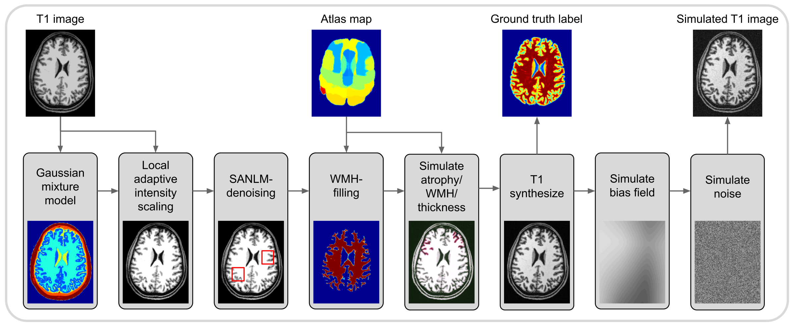
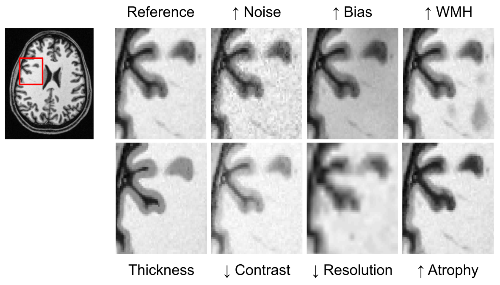
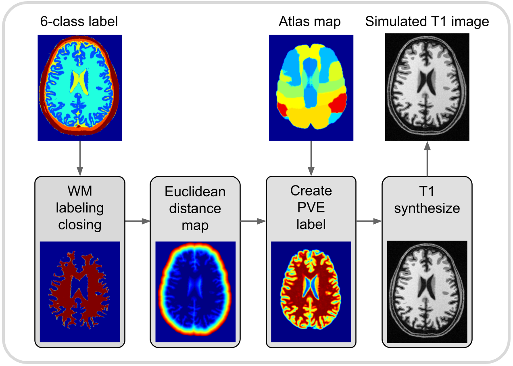

# mri_simulate
Simulates T1-weighted MR images with optional atrophy, cortical thickness control, WMHs, RF B1 inhomogeneities, and noise (Gaussian or Rician at a target WM SNR). Writes JSON sidecars with simulation metadata.



## Overview
`mri_simulate` generates a realistic T1-weighted (T1w) image and its explicit ground truth from a high-quality input (e.g., 0.5 mm Colin27 or a custom T1w). Key steps:

- Start from a segmented T1w volume (GM, WM, CSF, and background) using SPM unified segmentation; this is only an initialization.
- Locally normalize tissue intensities with CAT12 Local Adaptive Segmentation (LAS), scaling CSF/GM/WM to canonical values (1/2/3) to obtain a PVE-like label image.
- Denoise the scaled labels with SANLM; optionally close WM holes to remove native WMHs before adding synthetic lesions.
- Insert user-defined anatomical changes: atlas-based atrophy (e.g., Hammers) and probabilistic WMHs.
- Synthesize a new T1w as the probability-weighted mixture of the tissue means (estimated from the SPM Gaussian mixture) using the modified PVE labels and the optional WMH class as weights; everything that is not brain keeps the intensity of the bias-corrected input, and the two blend continuously at the brain boundary. Optionally modulate with RF bias fields and add Rician or Gaussian noise.
- Outputs follow BIDS-like naming with JSON sidecars capturing all simulation parameters.

This label-driven synthesis minimizes dependence on the initial segmentation while preserving realistic tissue topology. RF fields can be predefined (MNI A/B/C) or simulated, and contrast-to-noise ratio plus voxel size are user-controlled.



## Cortical thickness and PVE simulation
To validate cortical thickness pipelines, the label image can be edited directly:

- Cortical thickness is defined geometrically: WM is morphologically closed, then GM is grown via Euclidean distance maps to reach target thickness (global or 3-region using the neuromorphometrics atlas).
- Thickness values can vary across regions (e.g., frontal, occipital, remaining cortex) to produce known ground truth.
- Partial volume is approximated by jittering tissue boundaries across multiple subvoxel offsets and averaging hard labels (CSF=1, GM=2, WM=3), replacing the original SPM labels in synthesis.



## Requirements
- MATLAB with SPM12 (or SPM25) and CAT >= 26 in the path (`cat_main_LASsimple` is required and is checked for at startup)
- A T1-weighted NIfTI image (default examples use `colin27_t1_tal_hires.nii`)

No MATLAB toolboxes beyond base MATLAB are needed. The Image Processing Toolbox is used opportunistically (`bwdist` in the thickness simulation, with a `cat_vbdist` fallback), and the Parallel Computing Toolbox is used only when several input images are given.

## Inputs
### simu: Simulation parameters (struct)

Parameter | Description (Default)
----------|------------------------
name | Input image(s). A single T1w filename. (Default: `''`)
snrWM | add Rician magnitude noise with target SNR for white matter. Uses WM mean to derive complex noise sigma; when set, `pn` is ignored. (Default: `30`)
pn | If `>0`,add Gaussian noise as percent of the WM peak. (Default: `0`)
rng | RNG seed for reproducible noise. A fixed number gives every image the same noise pattern; `NaN` or `[]` derive the seed from the filename instead, so each image gets its own reproducible noise. (Default: `0`)
contrast | Power-law exponent for contrast change. Image is normalized to [0,1], transformed as Y.^contrast, then rescaled to original min/max. Meaningful values to simulate contrast are 0.5 (low contrast) and 1.5 (high contrast). (Default: `1`)
derivative | If `1`, save outputs into BIDS derivatives at the dataset root: `derivatives/mri_simulate-<version>/sub-*/ses-*/...`, mirroring the subject/session path. Thickness simulations use `mri_simulate_thickness-<version>`. (Default: `1`)
resolution | Output voxel size: scalar (applied to x,y,z) or `[x y z]`. `NaN` keeps the original resolution. (Default: `NaN`)
WMH | Strength of white matter hyperintensities. `0`=off; `1`=mild; `2`=medium; `3`=strong; values `>=1` allowed. Larger values broaden the WMH prior via exponent `1/(WMH-0.8)` and scale the label contribution by `~1/WMH^0.75`. Constrained to (eroded) WM and modulated by a random field. (Default: `0`)
atrophy | Atrophy specification: `{atlasName, roiIds[], factors[]}`; factors >1 increase CSF (reduce GM) within ROIs. Either thickness or atrophy can be simulated. (Default: `[]`)
thickness | Cortical thickness in mm. Scalar = global; 3-vector = `[occipital rest frontal]` using neuromorphometrics atlas masks. Subcortical/cerebellar regions are excluded from thickness simulation and the original thickness values are kept. Either thickness or atrophy can be simulated. (Default: `0`)
closeWMHholes | Detect and fill existing WMHs in WM so that the simulated image starts from a clean WM, which allows synthetic WMHs to be added via `WMH`. (Default: `0`)
parpool | Number of workers used when several input images are given and the Parallel Computing Toolbox is available; limited to the number of images. (Default: half the available cores)

### rf: RF bias field parameters (struct)

Parameter | Description (Default)
----------|------------------------
percent | Peak-to-peak amplitude in percent; negative values invert the field, i.e. swap its bright and dark areas at the same amplitude. (Default: `30`)
type | `'A'|'B'|'C'` (predefined MNI fields) or numeric `[strength rngSeed]` for a simulated field. Strength in `1..4` (3–4 ~ stronger 7T-like). (Default: `[2 0]`)
save | Save the simulated bias field only when `type` is numeric; ignored for `'A'|'B'|'C'`. (Default: `0`)

## Defaults
If `simu` and/or `rf` are omitted or partially specified, missing fields are filled with defaults. If `simu.name` is empty, a file selection dialog opens.

```matlab
simu = struct('name', '', 'snrWM', 30, 'pn', 0, 'contrast', 1, ...
              'resolution', NaN, 'WMH', 0, 'atrophy', [], 'thickness', 0, ...
              'rng', 0, 'derivative', 1, 'closeWMHholes', 1);
rf   = struct('percent', 30, 'type', [2 0], 'save', 0);
```

## Outputs
Output names follow the [BIDS](https://bids.neuroimaging.io) filename grammar: entity-value pairs followed by a suffix, where entity labels contain only letters and digits. All option tags are therefore collected into a single camelCase `desc` label, while the output resolution uses the standard `res` entity.

Per input image:
- Simulated image: `{entities}[_res-{vx}mm]_desc-{opts}_T1w.nii`
- Ground-truth PVE label: `{entities}[_res-{vx}mm][_desc-{anatOpts}]_dseg.nii`
- If requested (`rf.save=1`, simulated fields only): `{entities}[_res-{vx}mm]_desc-{anatOpts}Biasfield_T1w.nii`
- A JSON sidecar next to the simulated image and next to the label image

When `derivative=1`, a `dataset_description.json` is written to the root of the pipeline folder, which BIDS requires for a derivative dataset to be valid.

If the input name ends in `_T1w`, its entities are preserved and the new `res`/`desc` entities are inserted before the suffix (an existing `desc` entity of the input is replaced). For a non-BIDS input the basename is kept unchanged, so the result cannot be fully BIDS-valid — only the entities and the suffix added here follow the specification.

Notes:
- `{opts}` combines the noise tag (`snr30`, or `pn3` when `pn>0` and `snrWM=0`), the bias field (`Rf20A`, `Rf20T2`, `RfNeg20A` for an inverted field), the contrast (`ConLow`/`ConHigh`/`Con1p3`) and the anatomical tags.
- `{anatOpts}` covers only the anatomical options (`hammersRoi28F2`, `hammersMulti`, `Wmh2`, `Thickness25mm`, `Thickness15to25mm`). The label file omits the noise tag, since the ground truth does not depend on the noise level, so runs that differ only in SNR share one label file.
- Decimal points become `p` (`Con1.3` → `Con1p3`), since BIDS labels must be alphanumeric.
- `res` gives the voxel size in mm with the same `p` convention (`res-0p5mm`, `res-1mm`). Anisotropic voxels are listed per axis (`res-0p5x0p5x1p5mm`) rather than averaged — the previous mean-based `res-08mm` form was both unreadable and lossy, mapping `[0.75 0.75 0.75]` and `[0.5 0.5 1.5]` onto the same name.
- With no options at all the label would be empty, so `desc-simu` is used to keep the output distinct from the input.
- The `dseg` suffix normally implies integer labels; here the values are continuous PVE labels, which the label sidecar documents.
- When thickness is used, the label is PVE-like from the boundary jittering averaging.
- When WMH is used, a 4th label contribution is added (WMH).

## Usage
```matlab
mri_simulate(simu, rf);
```

### 1b) Rician noise at target WM SNR
```matlab
simu = struct('name', 'colin27_t1_tal_hires.nii', 'snrWM', 30, ...
              'resolution', NaN, 'rng', 0);
rf = struct('percent', 20, 'type', 'A', 'save', 0);
mri_simulate(simu, rf);
```

## Examples

### 1) Basic simulation with specific noise and 0.5 mm voxels
```matlab
simu = struct('name', 'colin27_t1_tal_hires.nii', 'snrWM', 10, ...
              'resolution', 0.5, 'atrophy', [], 'rng', 42);
rf = struct('percent', 20, 'type', 'A', 'save', 0);
mri_simulate(simu, rf);
```

### 2) Advanced simulation with atrophy (~10% in left middle frontal gyrus and ~15% in right middle frontal gyrus based on Hammers atlas), custom RF field and thicker slices
```matlab
simu = struct('name', 'custom_t1.nii', 'snrWM', 30, ...
              'resolution', [0.5, 0.5, 1.5], 'rng', []);
simu.atrophy = {'hammers', [28, 29], [2, 3]};
rf = struct('percent', 15, 'type', [3, 42], 'save', 0);
mri_simulate(simu, rf);
```

### 3) Thickness simulation (region-wise values, original resolution)
```matlab
simu = struct('name', 'colin27_t1_tal_hires.nii', 'snrWM', 10, ...
              'resolution', NaN, 'atrophy', [], 'rng', [], ...
              'thickness', [1.5 2.0 2.5]);
rf = struct('percent', 20, 'type', 'A', 'save', 0);
mri_simulate(simu, rf);
```

### 4) WMH simulation (medium strength) with simulated RF field
```matlab
simu = struct('name', 'custom_t1.nii', 'snrWM', 30, 'resolution', NaN, ...
              'WMH', 2, 'rng', []);
rf = struct('percent', 15, 'type', [3, 42], 'save', 0);
mri_simulate(simu, rf);
```

### 5) Interactive mode for example 4:
```matlab
simu = struct('snrWM', 30, 'resolution', NaN, ...
              'WMH', 2, 'rng', []);
rf = struct('percent', 15, 'type', [3, 42], 'save', 0);
mri_simulate(simu, rf);
```

### 6) Apply contrast change (power-law)
```matlab
simu = struct('name', 'colin27_t1_tal_hires.nii', 'snrWM', 30, ...
              'contrast', 1.3, 'resolution', NaN, 'rng', 0);
rf = struct('percent', 20, 'type', 'A', 'save', 0);
mri_simulate(simu, rf);
```

## File Naming Examples

For a BIDS input named `sub-01_T1w.nii`:

```
sub-01_desc-pn3Rf20A_T1w.nii                        % Gaussian noise at 3%
sub-01_desc-snr30Rf20A_T1w.nii                      % Rician noise at SNR=30 in WM
sub-01_res-1mm_desc-snr30Rf20A_T1w.nii              % Resampled to 1.0mm
sub-01_res-0p5x0p5x1p5mm_desc-snr30Rf20A_T1w.nii    % Anisotropic voxels
sub-01_res-1mm_desc-snr30RfNeg20A_T1w.nii           % Inverted bias field
sub-01_desc-snr30Rf20T2Con1p3_T1w.nii               % Simulated field, strength 2, contrast 1.3
sub-01_desc-snr30Rf20AThickness25mm_T1w.nii         % 2.5mm constant thickness
sub-01_desc-Thickness25mm_dseg.nii                  % Label for that thickness run
sub-01_desc-hammersRoi28F2_dseg.nii                 % Label for a single-ROI atrophy run
sub-01_desc-biasfield_T1w.nii                       % Saved RF field
```

Existing entities of the input are preserved and the new ones inserted before the suffix, e.g. `sub-01_ses-1_acq-mprage_T1w.nii` becomes `sub-01_ses-1_acq-mprage_desc-snr30Rf20A_T1w.nii`.

For a non-BIDS input such as `colin27_t1_tal_hires.nii` the basename is kept, so the result is not BIDS-valid even though the added entities are:

```
colin27_t1_tal_hires_desc-snr30Rf20A_T1w.nii
colin27_t1_tal_hires_dseg.nii
```
