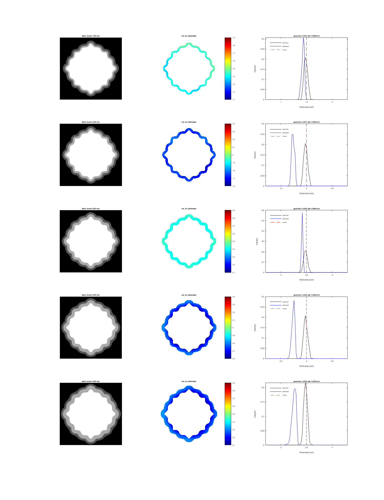

# mri_simulate
Simulates T1-weighted MR images with optional atrophy, cortical thickness control, WMHs, RF B1 inhomogeneities, and noise (Gaussian or Rician at a target WM SNR). Writes JSON sidecars with simulation metadata.


## Overview
`mri_simulate` generates a realistic T1-weighted (T1w) image and its explicit ground truth from a high-quality input (e.g., 0.5 mm Colin27 or a custom T1w). Key steps:

- Start from a segmented T1w volume (GM, WM, CSF, and background) using SPM unified segmentation with the bundled Blaiotta head and neck TPM (`BlaiottaTPM.nii`, seven tissue classes) and its batch job `BlaiottaSegmentJob.m`, both stored next to `mri_simulate.m`. The result is cached as `<name>_seg8.mat` next to the input and is only an initialization.
- Locally normalize tissue intensities with CAT12 Local Adaptive Segmentation (LAS), denoise with SANLM and skull-strip with CAT's adaptive probability region-growing (APRG), then scale CSF/GM/WM to canonical values (1/2/3) to obtain a PVE-like label image.
- Optionally close WM holes to remove native WMHs before adding synthetic lesions.
- Insert user-defined anatomical changes: atlas-based atrophy (e.g., Hammers) and probabilistic WMHs.
- Synthesize a new T1w as the probability-weighted mixture of the tissue means (estimated from the SPM Gaussian mixture) using the modified PVE labels and the optional WMH class as weights; everything that is not brain keeps the intensity of the bias-corrected input, and the two blend continuously at the brain boundary. Optionally modulate with RF bias fields, apply a contrast change and add Rician or Gaussian noise.
- Outputs follow BIDS-like naming with JSON sidecars capturing all simulation parameters.

The tissue means come from the Gaussian mixture of the segmentation, with one exception: GM and WM use the mixing-weighted mean over all their Gaussians, while CSF uses only its darkest Gaussian. The segmentation models CSF with two Gaussians and the brighter one regularly covers GM, so their mean would be far too bright — and that value is not only the CSF intensity of the synthesis but also the low anchor of the LAS correction and the skull stripping. A cached segmentation that describes CSF by a single Gaussian is reported with a warning.

This label-driven synthesis minimizes dependence on the initial segmentation while preserving realistic tissue topology. RF fields can be predefined (MNI A/B/C) or simulated, and contrast-to-noise ratio plus voxel size are user-controlled.


## Cortical thickness and PVE simulation
To validate cortical thickness pipelines, the label image can be edited directly:

- Cortical thickness is defined geometrically: the label is smoothed and grey-closed to repair thin WM, then GM is grown outward from the WM with CAT's exact Euclidean distance transform (`cat_bwdist`) up to the target thickness (global or 3-region using the neuromorphometrics atlas). No band is grown around the ventricles, the corpus callosum or any other non-cortical structure, since the CSF facing them is not a sulcus.
- Thickness values can vary across regions (e.g., frontal, occipital, remaining cortex) to produce known ground truth.
- The volume is internally resampled to 0.5 mm for the simulation and written back on the original or requested grid.
- Partial volume is approximated by jittering the tissue boundaries across 15 subvoxel offsets in [-0.25, 0.25] voxels and averaging hard labels (CSF=1, GM=2, WM=3), replacing the original SPM labels in synthesis.
- The original tissue fractions are blended back in where the simulation has nothing to add: inside the excluded structures, and deep inside the WM. The hard labels give a WM fraction of exactly 1 in the interior and therefore a perfectly flat WM, whereas the original fractions carry the local variation that a simulation without thickness manipulation shows. The blend stays a safe distance away from the GM/WM boundary, so the simulated thickness is untouched, and it is capped so that the ground truth cannot fall below the WM range.


## Geometric thickness phantom
`mri_simulate` gives a *real brain* a constant cortical thickness, so its ground truth is only as good as the segmentation it starts from. `thickness_phantom.m` answers the complementary question — what a thickness measure does when the geometry is known exactly — by building the object analytically instead:

- The WM is a sphere with regular folds, the GM is the band of constant thickness around it, and a CSF layer surrounds the GM.
- The phantom is free of artefacts by design and fully deterministic: no noise, no bias field, no random component anywhere. The error a thickness measure shows on it is its own theoretical error and nothing else.
- Outputs are a PVE label image (`_dseg.nii`, CSF=1, GM=2, WM=3) and the ideal T1w image (`_T1w.nii`) that belongs to it, each with a JSON sidecar that records the geometry.

### Why the thickness is exact
The GM is **not** made by offsetting the radius of the folded sphere. A radial offset of `t` gives a normal thickness of `t·cos(alpha)`, where `alpha` is the angle between the radius and the surface normal, so on the flanks of the folds the true thickness would come out too small. Instead the euclidean distance `D` to the WM is computed once with `cat_bwdist`, and **both cortical boundaries are level sets of that one distance map**: the WM/GM boundary is `D = wm_offset` and the GM/CSF boundary is `D = wm_offset + thickness`. Since `D` is 1-Lipschitz with a unit gradient, two of its level sets are exactly `thickness` apart everywhere, whatever the folds look like. This is the same construction `mri_simulate` uses for its cortical band, only starting from an analytic surface rather than a segmentation. The distance map is built on a supersampled grid (factor 3 by default), so the discretization of the surface stays well below the voxel size.

### Partial volume
The PVE follows the idea of `mri_simulate`: the tissue boundary is shifted across a set of sub-voxel offsets, each offset yields a hard label image, and the results are averaged. Here the offsets are applied to the distance map directly, which shifts both boundaries along their normal by a known amount. They are the midpoints of 15 equal intervals over one voxel, so for a locally flat boundary the average reproduces the exact linear PVE ramp — `mri_simulate` uses half that range because it applies the offsets to a label map it smoothed beforehand.

### Evaluation
`thickness_phantom_eval.m` checks two independent things, which is what makes the result interpretable: without the first, an error of the thickness measure cannot be told apart from an error of the phantom.

1. **Fidelity of the phantom.** The distance between the two boundaries is recovered from the label image alone — it is supersampled, `cat_bwdist` gives the distance from the WM surface, and that distance is read out on the GM/CSF isosurface at the sub-voxel crossings along the three axes (a layer of voxels would bias the readout by a good part of a sample). Tissue volumes are compared against the supersampled grid the phantom was built on. It also reports how much of the WM surface faces a *buried sulcus*, i.e. a fold narrower than twice the thickness where the CSF is squeezed out and the two GM banks touch — the situation that makes any thickness measure overestimate.
2. **Accuracy of a thickness measure**, optionally CAT's projection-based thickness `cat_vol_pbtsimple`, which takes exactly this kind of PVE label as input, over all GM voxels and on the central surface.



### Usage
```matlab
% one phantom with 2.5mm thickness at 0.5mm, then evaluate it
[~, ~, info] = thickness_phantom;
res = thickness_phantom_eval(info);

% a series of thickness values; they share the distance map, so this is
% barely slower than a single one
[~, ~, info] = thickness_phantom(struct('thickness', 1.5:0.5:3.5));
res = thickness_phantom_eval(info, struct('fig','phantom_qc.png'));

% the folding pattern of T1Prep/internal/thickness_phantom.py
thickness_phantom(struct('fold','spherical', 'folds',[6 6], 'radius',25, ...
                         'amplitude',2.5, 'thickness',3, 'csf',1));
```

Main parameters (see `help thickness_phantom` for all of them): `dim`, `vx`, `radius`, `amplitude`, `fold` (`'cartesian'` with a `wavelength`, or `'spherical'` with `folds` — note that the spherical pattern makes its folds arbitrarily fine towards the poles, where no voxel size resolves them), `thickness`, `csf`, `supersample`, `pve_steps`, `pve_range`.

### Results
Default phantom (radius 22 mm, fold amplitude 2.5 mm, wavelength 12 mm) at 0.5 mm, thickness 1.5–3.5 mm. `geometry` is the thickness recovered from the label image, i.e. the fidelity of the phantom; `pbt` is `cat_vol_pbtsimple` with its own defaults:

known | geometry bias | sd | pbt bias | sd | buried sulci
------|---------------|-----|----------|-----|-------------
1.5 mm | −0.014 | 0.036 | −0.068 | 0.027 | 0.0%
2.0 mm | −0.017 | 0.037 | −0.262 | 0.028 | 0.3%
2.5 mm | −0.018 | 0.036 | −0.085 | 0.013 | 4.2%
3.0 mm | −0.016 | 0.039 | −0.258 | 0.029 | 6.9%
3.5 mm | −0.018 | 0.035 | −0.243 | 0.039 | 10.3%

The geometric bias of about −0.017 mm is independent of the thickness and shrinks to −0.006 mm when the evaluation is supersampled by 5 instead of 3, i.e. most of what is left is the readout and not the phantom: the label image carries the requested thickness to well within a twentieth of a voxel. Tissue volumes agree with the supersampled reference to within 0.5% for CSF and WM and 1.5% for GM, the class that consists almost entirely of boundary voxels.

Against that, `cat_vol_pbtsimple` underestimates, and how much depends on the thickness in a way that is not monotonic. Its core algorithm is not the reason — with `pbtopt.supersimple = 1`, which switches the brain-specific refinements off, the bias is a near-constant −0.27 to −0.31 mm across the whole range. The jumps come from those refinements (myelin correction, sulcus/gyrus enhancement, sharpening, blood-vessel and topology correction), which sometimes recover about 0.2 mm of it and sometimes do not.

## Movement artefacts and ringing

`simu.motion` simulates head movement the way it actually corrupts an acquisition. Every phase-encoding line of k-space is sampled at a different time, so a line acquired after the head has moved belongs to a displaced object while the reconstruction treats all of them as one. The simulation therefore transforms the image, Fourier transforms it, and assembles k-space from contiguous blocks of lines taken from differently posed copies. The mismatch between the blocks produces the ringing and ghosting along the phase-encoding direction that is typical for motion.

Note that shifting the samples *inside* k-space, which descriptions of such tools often suggest, is not the same thing: a circular shift of k-space by Δk multiplies the image by `exp(2πi·Δk·r)` and leaves the magnitude image unchanged. What motion does is the dual of that — a translation by Δr multiplies k-space by `exp(-2πi·k·Δr)`. Translations are therefore applied as an exact linear phase ramp with no interpolation, while rotations rotate k-space itself and cannot be written as a phase, so the volume is resampled before its transform.

A scalar gives the severity, and the number of events and both amplitudes grow with `severity^1.5`:

Severity | Events | Max translation | Max rotation
---------|--------|-----------------|-------------
1 (mild) | 1 | 1.0 mm | 1.0°
2 (moderate) | 3 | 2.8 mm | 2.8°
3 (severe) | 5 | 5.2 mm | 5.2°

Each event is one instructed nod: an excursion lasting a single block plus a residual offset of 30% of its amplitude that persists to the end of the scan, since the head rarely returns exactly to its former position. Pitch dominates, as it does for real nodding.

A struct overrides single values:

Field | Meaning (Default)
------|------------------
severity | Base of all the defaults below (required, or `1` if a struct is given without it)
events | Number of motion events (`round(severity^1.5)`)
translation | Maximum translation in mm (`severity^1.5`)
rotation | Maximum rotation in degrees (`severity^1.5`)
blocks | Number of k-space blocks. This is the temporal resolution of the motion and therefore also the duration of one excursion (`32`, about 5–10 s of a typical 5 min MPRAGE, i.e. the time scale of a nod)
continuous | Amplitude of a continuous drift and tremor between the events, as a fraction of `translation` (`0.2`; `0` leaves the pose piecewise constant)
pe | Phase-encoding direction, a voxel axis (`1`,`2`,`3`) or a world axis (`'x'` left-right, `'y'` anterior-posterior, `'z'` inferior-superior) mapped to the closest voxel axis (`'y'`, the usual in-plane direction of a sagittal MPRAGE)
ordering | `'linear'` fills k-space from −kmax to +kmax, so its centre is sampled in the middle of the scan; `'centric'` starts at the centre (`'linear'`)
centre | Place the first event in the block that samples the centre of k-space (`1`)

Two properties are worth knowing when using this for validation:

- **The severity depends far more on whether the centre of k-space is hit than on the amplitude**, because the centre carries most of the energy. `centre=1` therefore forces the first event there, which keeps the severity levels comparable between images instead of leaving them to the random position of the events. Set it to `0` for a purely random time course.
- **The ground truth is unaffected**, since motion does not change the anatomy. `motion` only enters the `desc` tag of the simulated image, so runs that differ only in the motion share one label file. The pose that is subtracted from all blocks is the mean weighted by their k-space energy, which is where the object appears, so the simulated image stays where its label image is. A sub-voxel displacement along the phase-encoding axis is left over and grows with the severity, from about a tenth of a voxel for mild to about half a voxel for severe motion.

The realized motion is written to the JSON sidecar under `SimulationParameters.Motion`, including `Pose`, the full pose time course with one row per k-space block in acquisition order (translations in mm, rotations in degrees, both in world coordinates), which is the ground truth of the movement itself.

### The continuous component

A pose that is piecewise constant with a handful of steps gives a handful of discontinuities in k-space, and therefore ringing along the edges alone. A real motion-corrupted image carries the dense ripple texture of many small ones, because real motion always has drift and tremor between the deliberate movements. `continuous` adds a slow drift and two slow oscillations on top of the events, which is what makes the result look like a rejected scan rather than a blurred one.

It enters as a translation only. A translation is free in k-space (a phase ramp), while a rotation needs the volume resampled once more, and the assembly is grouped so that one resampling serves all the blocks sharing a rotation. The runtime therefore follows the number of *events*, not the number of blocks: measured on a 1 mm volume, a rotation resampling costs 2.9 s, so ~11 distinct rotations are ~30 s whether or not every block has its own translation. Giving the continuous component its own rotations would have made it 32 resamplings, i.e. ~90 s at 1 mm and ~12 min at 0.5 mm.

## Ringing

`simu.ringing` is a separate artefact and can be combined with `motion`. There are **two types**, which are different artefacts and not two settings of one.

Field | Meaning (Default)
------|------------------
strength | `0`=off, `1`/`2`/`3` = mild/moderate/severe, any positive value allowed
type | `'notch'` (default) or `'gibbs'`
pe | Axis the ringing runs along: `1`,`2`,`3`, `'x'`/`'y'`/`'z'`, or `'all'` (`'y'`)
k0 | Band centre for `notch`, in units of the Nyquist frequency (`0.6`, where mriaug puts it)

### `notch` — the pronounced regular ripples

Damps or inverts a narrow band of k-space at `|k| = k0`; the gain inside the band is `1 - strength`, so the band is removed at strength 1 and inverted above it. Narrow in k-space means far-reaching in the image, so a single spatial frequency is laid over the whole image and shows as the strong regular ripple pattern that reads as ringing at first sight — **without** the blurring that truncation brings.

This is what [mriaug](https://github.com/codingfisch/mriaug)'s `ringing3d` does, and it is what to use when the *appearance* of ringing is the goal. It is not what a scanner does: no acquisition removes an isolated band of frequencies.

With `pe` set to a single axis the band is a flat slab, which gives directional stripes. With `'all'` it is a spherical shell, which gives concentric rings around edges.

Implementation note: mriaug builds its band on uncentred array-index coordinates applied to unshifted k-space, so the band lands on one side of k-space only (at about `0.6` Nyquist), and its `torch.fft.irfftn` call then re-symmetrises the result. The version here uses a properly centred, symmetric band at the same `|k|`, which is real by construction. Checked side by side on a 1 mm T1, the two are visually indistinguishable and differ by 0.063 vs 0.058 relative difference at equal depth.

### `gibbs` — the physical one

The ripple that a finite acquisition matrix really produces: keep only the central part of k-space and reconstruct on the same grid. It overshoots a step edge by about 9%, as a rect window should.

Strength | k-space kept | ripple period
---------|--------------|--------------
1 | 0.55 | ~3.6 voxels
2 | 0.40 | ~4.9 voxels
3 | 0.25 | ~8 voxels

Two properties are worth knowing, and both were got wrong in the first version of this option:

- **The overshoot is ~9% whatever the fraction is** — that is the Gibbs constant. Only the *period* of the ripples changes, roughly as `2/fraction` voxels. Above a fraction of about 0.6 the period is two to three voxels, which is the scale of the image texture, so it reads as noise and the only visible effect is the blur. Blurring and ringing cannot be separated here: they are two sides of the same truncation, and buying visible ripples always costs resolution. That is exactly why `notch` exists as a separate type.
- **Only the phase-encoding axis is truncated by default.** That is the axis whose matrix an acquisition actually shortens while the readout is oversampled, and it is why clinical Gibbs ringing appears as bands along one direction. Truncating all three axes equally is an isotropic softening and reads as smoothing, not ringing.

### Both types

The `desc` tag keeps them apart (`Ringing2` for the notch, `Ringing2Gibbs`), so runs of the two types cannot overwrite each other.

**Gibbs ringing and motion ringing are two different things.** Motion ringing comes from the mismatch between k-space lines acquired at different times; Gibbs ringing from k-space ending at a finite frequency. Only the latter is in every image whether the head moved or not. When both are requested they share one k-space: the truncation is applied to the k-space the motion assembled, before the magnitude image is reconstructed, which is the order a scanner produces them in — and that is measurably not the same as applying one after the other.

### Comparison with mriaug

[mriaug](https://github.com/codingfisch/mriaug) is a natural reference, since it also works in k-space. Its `motion3d` is

```python
offset = intensity * fft.fftn(translate3d(x, translate=translate))
return modify_k_space(x, gain=1 - intensity, offset=offset)   # k*gain + offset
```

i.e. `K = (1-α)·FFT(x) + α·FFT(shift(x))`. That gain and offset are uniform over all of k-space, so by linearity it equals `(1-α)·x + α·shift(x)` — a plain alpha blend of the image with a translated copy. Checked numerically on a 1 mm T1, the two agree to `6.7e-16`, i.e. the FFT round-trip does nothing. There is no k-space segmentation, hence no discontinuity and no ringing: of the residual energy only 11% lies in the outer half of k-space, against 48% for the block model here. Visually it is a double exposure rather than a motion artefact.

mriaug's `ringing3d` is not Gibbs ringing either — it damps a narrow band of k-space by `1 - 10*intensity`, i.e. a factor of **−4** at its documented default. That is not what a finite acquisition matrix does, but it is a very effective way to *look* like ringing, so it is available here as the `notch` type (see [Ringing](#ringing)).

So mriaug is not a better starting point for the motion model, but its ringing operator is worth having, which is why `simu.ringing` offers both types.

## Limitations of the artefact models

The motion model is retrospective: it splices k-space blocks of a rigidly moved object. Real motion is continuous rather than piecewise constant (which `continuous` mitigates but does not remove), and the spin-history and coil-sensitivity effects of an inversion-recovery sequence like MPRAGE are not reproduced. The appearance and severity of the artefact are realistic; its fine structure is not a substitute for a real motion-corrupted acquisition.

## Requirements
- MATLAB with SPM12 (or SPM25) and CAT >= 26 in the path (`cat_main_LASsimple` is required and is checked for at startup)
- A T1-weighted NIfTI image, `.nii` or `.nii.gz` (default examples use `colin27_t1_tal_hires.nii`)
- `BlaiottaTPM.nii` and `BlaiottaSegmentJob.m` next to `mri_simulate.m`; the run stops with an error if either is missing

No MATLAB toolboxes beyond base MATLAB are needed. Distances use CAT's `cat_bwdist` (and `cat_vbdist` where the index of the nearest voxel is needed) rather than the Image Processing Toolbox, so results do not depend on which toolboxes are installed. The Parallel Computing Toolbox is used only when several input images are given.

## Inputs
### simu: Simulation parameters (struct)

Parameter | Description (Default)
----------|------------------------
name | Input image(s). A single T1w filename, either `.nii` or `.nii.gz`. A compressed image is uncompressed next to the original before the segmentation runs, and the image outputs are written compressed as well (the JSON sidecars are always plain text). (Default: `''`)
snrWM | add Rician magnitude noise with target SNR for white matter. Uses WM mean to derive complex noise sigma; when set, `pn` is ignored. (Default: `40`)
pn | If `>0`,add Gaussian noise as percent of the WM peak. (Default: `0`)
rng | RNG seed for reproducible noise. A fixed number gives every image the same noise pattern; `NaN` or `[]` derive the seed from the filename instead, so each image gets its own reproducible noise. (Default: `0`)
contrast | Power-law exponent for contrast change. Image is normalized to [0,1], transformed as Y.^contrast, then rescaled to original min/max. Meaningful values to simulate contrast are 0.5 (low contrast) and 1.5 (high contrast). (Default: `1`)
motion | Movement artefacts. Scalar severity (`0`=off, `1`/`2`/`3` = mild/moderate/severe, intermediate and larger values allowed), or a struct with `severity`, `events`, `translation` (mm), `rotation` (deg), `blocks`, `continuous`, `pe`, `ordering` and `centre` to override single values. See [Movement artefacts and ringing](#movement-artefacts-and-ringing). (Default: `0`)
ringing | Ringing. `0`=off, `1`/`2`/`3` = mild/moderate/severe, or a struct with `strength`, `type` (`'notch'` default, or `'gibbs'`), `pe` and `k0`. Independent of `motion` and combinable with it. See [Ringing](#ringing). (Default: `0`)
derivative | If `1`, save outputs into BIDS derivatives at the dataset root: `derivatives/mri_simulate-<version>/sub-*/ses-*/...`, mirroring the subject/session path. Thickness simulations use `mri_simulate_thickness-<version>`. (Default: `1`)
resolution | Output voxel size: scalar (applied to x,y,z) or `[x y z]`. `NaN` keeps the original resolution. (Default: `NaN`)
WMH | Strength of white matter hyperintensities. `0`=off; `1`=mild; `2`=medium; `3`=strong; values `>=1` allowed. Larger values broaden the WMH prior via exponent `1/(WMH-0.8)` and scale the label contribution by `~1/WMH^0.75`. Constrained to (eroded) WM and modulated by a random field. (Default: `0`)
atrophy | Atrophy specification: `{atlasName, roiIds[], factors[]}`; factors >1 increase CSF (reduce GM) within ROIs. Either thickness or atrophy can be simulated. (Default: `[]`)
thickness | Cortical thickness in mm. Scalar = global; 3-vector = `[occipital rest frontal]` using neuromorphometrics atlas masks. The volume is internally resampled to 0.5 mm and written back at the requested resolution. The non-cortical structures of the atlas (subcortical grey matter, cerebellum, brainstem, hippocampus, vessels, basal forebrain) keep their original labels, and no cortical band is grown around them or around the ventricles. Either thickness or atrophy can be simulated. (Default: `0`)
closeWMHholes | Detect and fill existing WMHs in WM so that the simulated image starts from a clean WM, which allows synthetic WMHs to be added via `WMH`. Costs minutes, since it runs CAT's WMH detection. (Default: `0`)
parpool | Number of workers used when several input images are given and the Parallel Computing Toolbox is available; limited to the number of images. (Default: half the available cores)

### rf: RF bias field parameters (struct)

Parameter | Description (Default)
----------|------------------------
percent | Peak-to-peak amplitude in percent; negative values invert the field, i.e. swap its bright and dark areas at the same amplitude. (Default: `30`)
type | `'A'|'B'|'C'` (predefined MNI fields) or numeric `[strength rngSeed]` for a simulated field. Strength in `1..4` (3–4 ~ stronger 7T-like). (Default: `[2 0]`)
save | Save the simulated bias field only when `type` is numeric; ignored for `'A'|'B'|'C'`. (Default: `0`)

## Defaults
If `simu` and/or `rf` are omitted or partially specified, missing fields are filled with defaults. If `simu.name` is empty, a file selection dialog opens.

```matlab
simu = struct('name', '', 'snrWM', 40, 'pn', 0, 'contrast', 1, ...
              'motion', 0, 'ringing', 0, ...
              'resolution', NaN, 'WMH', 0, 'atrophy', [], 'thickness', 0, ...
              'rng', 0, 'derivative', 1, 'closeWMHholes', 0, ...
              'parpool', feature('numcores')/2);
rf   = struct('percent', 30, 'type', [2 0], 'save', 0);
```

## Outputs
Output names follow the [BIDS](https://bids.neuroimaging.io) filename grammar: entity-value pairs followed by a suffix, where entity labels contain only letters and digits. All option tags are therefore collected into a single camelCase `desc` label, while the output resolution uses the standard `res` entity.

Per input image:
- Simulated image: `{entities}[_res-{vx}mm]_desc-{opts}_T1w.nii`
- Ground-truth PVE label: `{entities}[_res-{vx}mm][_desc-{anatOpts}]_dseg.nii`
- If requested (`rf.save=1`, simulated fields only): `{entities}[_res-{vx}mm]_desc-{anatOpts}Biasfield_T1w.nii`
- A JSON sidecar next to the simulated image and next to the label image

When `derivative=1`, a `dataset_description.json` is written to the root of the pipeline folder, which BIDS requires for a derivative dataset to be valid.

For a `.nii.gz` input all image outputs are written as `.nii.gz`; the JSON sidecars name the compressed input in their `Sources` field. The uncompressed working copy of the input is removed again, while `<name>_seg8.mat` stays next to the input as the segmentation cache.

If the input name ends in `_T1w`, its entities are preserved and the new `res`/`desc` entities are inserted before the suffix (an existing `desc` entity of the input is replaced). For a non-BIDS input the basename is kept unchanged, so the result cannot be fully BIDS-valid — only the entities and the suffix added here follow the specification.

Notes:
- `{opts}` combines the noise tag (`snr30`, or `pn3` when `pn>0` and `snrWM=0`), the bias field (`Rf20A`, `Rf20T2`, `RfNeg20A` for an inverted field), the contrast (`ConLow`/`ConHigh`/`Con1p3`), the movement artefacts (`Motion2`), the ringing (`Ringing2`) and the anatomical tags.
- `{anatOpts}` covers only the anatomical options (`hammersRoi28F2`, `hammersMulti`, `Wmh2`, `Thickness25mm`, `Thickness15to25mm`). The label file omits the noise tag, since the ground truth does not depend on the noise level, so runs that differ only in SNR share one label file.
- Decimal points become `p` (`Con1.3` → `Con1p3`), since BIDS labels must be alphanumeric.
- `res` gives the voxel size in mm with the same `p` convention (`res-0p5mm`, `res-1mm`). Anisotropic voxels are listed per axis (`res-0p5x0p5x1p5mm`) rather than averaged — the previous mean-based `res-08mm` form was both unreadable and lossy, mapping `[0.75 0.75 0.75]` and `[0.5 0.5 1.5]` onto the same name.
- With no options at all the label would be empty, so `desc-simu` is used to keep the output distinct from the input.
- The `dseg` suffix normally implies integer labels; here the values are continuous PVE labels, which the label sidecar documents.
- When thickness is used, the label is PVE-like from the boundary jittering averaging.
- When WMH is used, a 4th label contribution is added (WMH).

## Usage
```matlab
mri_simulate(simu, rf);
```

### 1b) Rician noise at target WM SNR
```matlab
simu = struct('name', 'colin27_t1_tal_hires.nii', 'snrWM', 30, ...
              'resolution', NaN, 'rng', 0);
rf = struct('percent', 20, 'type', 'A', 'save', 0);
mri_simulate(simu, rf);
```

## Examples

### 1) Basic simulation with specific noise and 0.5 mm voxels
```matlab
simu = struct('name', 'colin27_t1_tal_hires.nii', 'snrWM', 10, ...
              'resolution', 0.5, 'atrophy', [], 'rng', 42);
rf = struct('percent', 20, 'type', 'A', 'save', 0);
mri_simulate(simu, rf);
```

### 2) Advanced simulation with atrophy (~10% in left middle frontal gyrus and ~15% in right middle frontal gyrus based on Hammers atlas), custom RF field and thicker slices
```matlab
simu = struct('name', 'custom_t1.nii', 'snrWM', 30, ...
              'resolution', [0.5, 0.5, 1.5], 'rng', []);
simu.atrophy = {'hammers', [28, 29], [2, 3]};
rf = struct('percent', 15, 'type', [3, 42], 'save', 0);
mri_simulate(simu, rf);
```

### 3) Thickness simulation (region-wise values, original resolution)
```matlab
simu = struct('name', 'colin27_t1_tal_hires.nii', 'snrWM', 10, ...
              'resolution', NaN, 'atrophy', [], 'rng', [], ...
              'thickness', [1.5 2.0 2.5]);
rf = struct('percent', 20, 'type', 'A', 'save', 0);
mri_simulate(simu, rf);
```

### 4) WMH simulation (medium strength) with simulated RF field
```matlab
simu = struct('name', 'custom_t1.nii', 'snrWM', 30, 'resolution', NaN, ...
              'WMH', 2, 'rng', []);
rf = struct('percent', 15, 'type', [3, 42], 'save', 0);
mri_simulate(simu, rf);
```

### 5) Interactive mode for example 4:
```matlab
simu = struct('snrWM', 30, 'resolution', NaN, ...
              'WMH', 2, 'rng', []);
rf = struct('percent', 15, 'type', [3, 42], 'save', 0);
mri_simulate(simu, rf);
```

### 6) Compressed BIDS input
```matlab
simu = struct('name', 'bids/sub-01/anat/sub-01_T1w.nii.gz', 'snrWM', 40, ...
              'resolution', NaN, 'rng', 0);
rf = struct('percent', 20, 'type', 'A', 'save', 0);
mri_simulate(simu, rf);
% -> bids/derivatives/mri_simulate-<version>/sub-01/anat/sub-01_desc-snr40Rf20A_T1w.nii.gz
```

### 7) Apply contrast change (power-law)
```matlab
simu = struct('name', 'colin27_t1_tal_hires.nii', 'snrWM', 30, ...
              'contrast', 1.3, 'resolution', NaN, 'rng', 0);
rf = struct('percent', 20, 'type', 'A', 'save', 0);
mri_simulate(simu, rf);
```

### 8) Movement artefacts of moderate severity
```matlab
simu = struct('name', 'colin27_t1_tal_hires.nii', 'snrWM', 40, 'motion', 2);
rf = struct('percent', 20, 'type', 'A');
mri_simulate(simu, rf);
```

### 9) Movement artefacts with full control
```matlab
simu = struct('name', 'colin27_t1_tal_hires.nii', 'snrWM', 40);
simu.motion = struct('severity', 2, 'events', 3, 'translation', 4, ...
                     'rotation', 4, 'pe', 'y', 'ordering', 'linear');
mri_simulate(simu);
```

### 10) Ringing, alone and combined with movement
```matlab
simu = struct('name', 'colin27_t1_tal_hires.nii', 'snrWM', 40, 'ringing', 2);
mri_simulate(simu, struct('percent', 0));   % notch, the pronounced ripples
simu.motion = 2;
mri_simulate(simu, struct('percent', 0));

% the physical variant, and a spherical shell giving concentric rings
simu.motion  = 0;
simu.ringing = struct('strength', 2, 'type', 'gibbs');
mri_simulate(simu, struct('percent', 0));
simu.ringing = struct('strength', 2, 'pe', 'all');
mri_simulate(simu, struct('percent', 0));
```

A series that differs only in the severity shares one ground truth label file, which makes it a graded test set for the robustness of a morphometry pipeline against motion:

```matlab
simu = struct('name', 'colin27_t1_tal_hires.nii', 'snrWM', 40);
for severity = [0 1 2 3]
  simu.motion = severity;
  mri_simulate(simu, struct('percent', 0));
end
```

## File Naming Examples

For a BIDS input named `sub-01_T1w.nii`:

```
sub-01_desc-pn3Rf20A_T1w.nii                        % Gaussian noise at 3%
sub-01_desc-snr30Rf20A_T1w.nii                      % Rician noise at SNR=30 in WM
sub-01_res-1mm_desc-snr30Rf20A_T1w.nii              % Resampled to 1.0mm
sub-01_res-0p5x0p5x1p5mm_desc-snr30Rf20A_T1w.nii    % Anisotropic voxels
sub-01_res-1mm_desc-snr30RfNeg20A_T1w.nii           % Inverted bias field
sub-01_desc-snr30Rf20T2Con1p3_T1w.nii               % Simulated field, strength 2, contrast 1.3
sub-01_desc-snr30Rf20AMotion2_T1w.nii               % Moderate movement artefacts
sub-01_desc-snr30Rf20AMotion2Ringing2_T1w.nii       % Movement and notch ringing
sub-01_desc-snr30Rf20ARinging2Gibbs_T1w.nii         % The gibbs ringing type
sub-01_dseg.nii                                     % Shared by every motion/ringing run
sub-01_desc-snr30Rf20AThickness25mm_T1w.nii         % 2.5mm constant thickness
sub-01_desc-Thickness25mm_dseg.nii                  % Label for that thickness run
sub-01_desc-hammersRoi28F2_dseg.nii                 % Label for a single-ROI atrophy run
sub-01_desc-biasfield_T1w.nii                       % Saved RF field
```

Existing entities of the input are preserved and the new ones inserted before the suffix, e.g. `sub-01_ses-1_acq-mprage_T1w.nii` becomes `sub-01_ses-1_acq-mprage_desc-snr30Rf20A_T1w.nii`. A `sub-01_T1w.nii.gz` input gives the same names with a `.nii.gz` extension.

For a non-BIDS input such as `colin27_t1_tal_hires.nii` the basename is kept, so the result is not BIDS-valid even though the added entities are:

```
colin27_t1_tal_hires_desc-snr30Rf20A_T1w.nii
colin27_t1_tal_hires_dseg.nii
```
